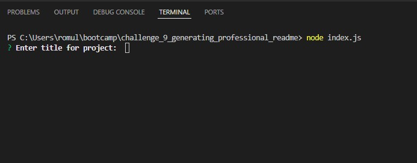
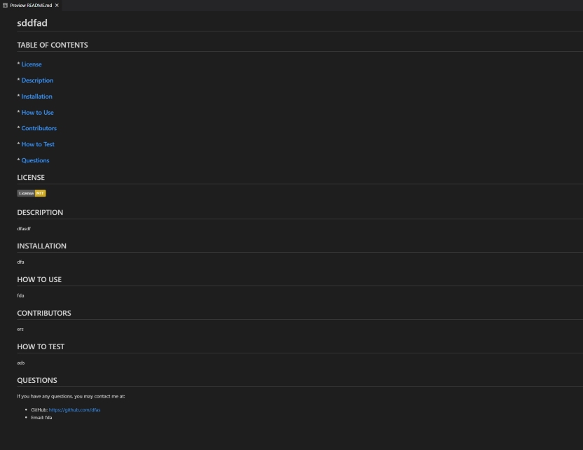

# CHALLENGE 9 PROFESSIONAL README GENERATOR

## DESCRIPTION
Have you ever been confused on how to create a Professional README.md file? Well, look no further! You can now simply run this application and you will be prompted with multiple questions to help write your README.md file. Just follow the prompts and answer them accordingly. This application will format it to the perfect README file.

## HOW TO USE
To use this program, it is simple. You must first have node installed. To check if you have it installed, open a new terminal, type 'node --version'. If you have it installed, you should see a version number. If you do not have node installed, then head over to 'https://nodejs.org/en/download'. Download the correct node for your operating system and install.

Once installed, open a new terminal in your VS Code and type 'node index.js'. This will run the program and you will be presented with multiple questions to fill out. Once you've completed all the questions, your README.md file will be created under the 'db' folder tab. CONGRATULATIONS! You have successfully created a professional README file.

## ACCEPTANCE CRITERIA
GIVEN a command-line application that accepts user input\
WHEN I am prompted for information about my application repository\
THEN a high-quality, professional README.md is generated with the title of my project and sections entitled Description, Table of Contents, Installation, Usage, License, Contributing, Tests, and Questions\
WHEN I enter my project title\
THEN this is displayed as the title of the README\
WHEN I enter a description, installation instructions, usage information, contribution guidelines, and test instructions\
THEN this information is added to the sections of the README entitled Description, Installation, Usage, Contributing, and Tests\
WHEN I choose a license for my application from a list of options\
THEN a badge for that license is added near the top of the README and a notice is added to the section of the README entitled License that explains which license the application is covered under\
WHEN I enter my GitHub username\
THEN this is added to the section of the README entitled Questions, with a link to my GitHub profile\
WHEN I enter my email address\
THEN this is added to the section of the README entitled Questions, with instructions on how to reach me with additional questions\
WHEN I click on the links in the Table of Contents\
THEN I am taken to the corresponding section of the README

## VIEWING MY PROJECT
Link to Deployed Application: <i>https://github.com/rapostoljr/challenge_9_generating_professional_readme.git</i>